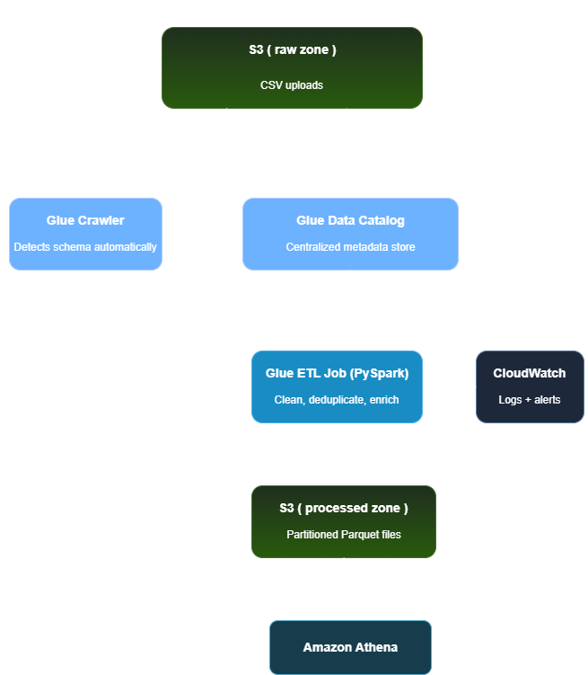

# Fintech Fraud Analytics Pipeline
### AWS Batch Data Engineering Project
 
A production-style batch data pipeline that ingests raw card transaction data, joins four source tables, applies transformations, and surfaces fraud patterns through SQL-ready analytical tables — built entirely on AWS.
 
---
 
## Problem Statement
 
The fraud analytics team had no reliable way to run cross-source queries across transaction, card, user, and merchant category data without manual effort. This pipeline automates daily ingestion, joins all four sources into one enriched analytical layer, and makes it queryable via Athena within minutes of data arrival.
 
---

## Architecture
 
```
Raw CSVs / JSON
      ↓
S3 (raw zone)
      ↓
AWS Glue Crawlers (×4, one per source)
      ↓
Glue Data Catalog (fraud_db)
      ↓
Glue ETL Job (PySpark) — join + transform
      ↓
S3 (processed zone, partitioned Parquet)
      ↓
Glue Crawler (processed)
      ↓
Amazon Athena — SQL analytics
      ↓
Business insights
```
 

 
---

## Dataset
 
**Source**: [Transactions Fraud Dataset — Kaggle](https://www.kaggle.com/datasets/computingvictor/transactions-fraud-datasets)
 
| Table | File | Rows (approx) | Key field |
|---|---|---|---|
| Transactions | transactions_data.csv | ~2.5M | transaction_id |
| Cards | cards_data.csv | ~6,000 | card_id |
| Users | users_data.csv | ~2,000 | client_id |
| MCC Codes | mcc_codes.json | ~200 | mcc_code |
| Fraud Labels | fraud_labels.csv | ~1.7M | transaction_id |
 
---
 
## AWS Services Used
 
| Service | Role |
|---|---|
| Amazon S3 | Raw and processed data storage |
| AWS Glue Crawlers | Schema detection and Data Catalog population |
| AWS Glue Data Catalog | Centralised metadata store |
| AWS Glue ETL (PySpark) | Multi-table join, transformation, Parquet write |
| Amazon Athena | SQL querying over processed Parquet data |
| Amazon CloudWatch | Job monitoring and failure alerting |
| Amazon SNS | Email notifications on pipeline failure |
| AWS IAM | Least-privilege access control |
 
---
 
## Pipeline Stages
 
### Stage 1 — Raw Ingestion
Five source files uploaded to `s3://fraud-pipeline-raw/` under entity-specific prefixes:
```
fraud-pipeline-raw/
  transactions/transactions_data.csv
  cards/cards_data.csv
  users/users_data.csv
  mcc/mcc_codes.csv
  fraud/fraud_labels.csv
```
 
### Stage 2 — Schema Detection
Four Glue Crawlers (one per source) scan the raw prefixes and populate `fraud_db` in the Glue Data Catalog — automatically inferring column names and types.
 
### Stage 3 — ETL Transformation
A single Glue ETL job (PySpark) performs:
- **Type casting** — dates, amounts, IDs corrected from crawler-inferred types
- **Null handling** — flagged rather than dropped to preserve analytical coverage
- **Data cleaning** — `$` and `,` stripped from financial columns, cast to float
- **Sensitive data** — `card_number` hashed via SHA-256, `cvv` dropped entirely
- **Derived columns** — `is_fraud` boolean, `transaction_type` (purchase/refund), `age_range`, `credit_range`, `fraud_label` (fraud/legitimate/unknown)
- **Multi-table join** — transactions joined to cards, users, MCC codes, and fraud labels
- **Parquet output** — partitioned by `year` and `month`, written to processed zone
### Stage 4 — Query Layer
A second Glue Crawler catalogs the processed Parquet output. Athena queries the processed table with full partition pruning on `year`/`month`.
 
---
 
## Key Design Decisions
 
**Why Parquet over CSV for the processed layer?**
Parquet is columnar — Athena scans only the columns referenced in a query rather than every column in every row. For a 25+ column table, a query touching 4 columns scans ~85% less data, directly reducing both query time and cost.
 
**Why partition by year and month?**
Athena uses partition values to skip entire folders when queries filter by date range. Time-series fraud analysis almost always filters by recent periods — partitioning by year/month is the highest-leverage optimisation available without infrastructure changes.
 
**Why left joins throughout?**
An inner join would silently drop any transaction whose card_id didn't exist in the cards table. Left joins preserve all transactions and surface mismatches as nulls — making data quality issues visible rather than hiding them in a smaller-than-expected row count.
 
**Why one ETL job instead of one per source?**
The four sources are always consumed together for fraud analysis. Separate jobs would require orchestrating dependencies with no analytical benefit. One job, one schedule, one success/failure signal.
 
**Why hash card_number and drop CVV?**
`card_number` hashed with SHA-256 preserves grouping capability (same card always produces same hash) without exposing raw PAN data. CVV has no legitimate analytical value — storing it in any form beyond point-of-authorisation violates PCI DSS principles.
 
**Why `fraud_label` as a derived categorical instead of raw `is_fraud` boolean?**
33% of transactions had no fraud label in the source data. Treating unlabeled transactions as `False` (legitimate) would silently corrupt fraud rate calculations. `fraud_label` makes the three-state reality explicit: `fraud`, `legitimate`, `unknown` — queries can deliberately exclude unknowns rather than accidentally including them.
 
---
 
## Transformation Logic
 
### Cards table
```python
CAST(id AS string) AS card_id
sha2(CAST(card_number AS STRING), 256) AS hashed_card_value
# cvv dropped entirely — no analytical value, highest PCI sensitivity
CAST(regexp_replace(credit_limit, '[$,]', '') AS float) AS credit_limit
to_date(expires, 'MM/yyyy') AS expires          # day defaults to 01 — documented convention
to_date(acct_open_date, 'MM/yyyy') AS acct_open_date
```
 
### Users table
```python
CASE WHEN credit_score <= 579 THEN 'Poor'
     WHEN credit_score <= 669 THEN 'Fair'
     WHEN credit_score <= 739 THEN 'Good'
     WHEN credit_score <= 799 THEN 'Very Good'
     ELSE 'Excellent' END AS credit_range
 
CASE WHEN current_age < 18 THEN 'Under 18'
     WHEN current_age <= 29 THEN 'Young Adults'
     WHEN current_age <= 55 THEN 'Established Borrowers'
     ELSE 'Older Borrowers' END AS age_range
```
 
### Transactions table
```python
CAST(regexp_replace(amount, '[$,]', '') AS float) AS amount
CASE WHEN amount < 0 THEN 'refund' ELSE 'purchase' END AS transaction_type
to_timestamp(date, 'yyyy-MM-dd HH:mm:ss') AS transaction_date
```
 
---
 
## Business Questions Answered
 
### Layer 1 — Scale & Scope
1. What percentage of transactions are fraudulent by merchant category?
2. Which customer age groups are most targeted?
3. What is the average transaction amount for fraudulent vs legitimate transactions?
4. Which US states have the highest fraud rates?
### Layer 2 — Customer Profile
5. Which credit range has the highest fraud rate?
6. Do customers with more credit cards have higher fraud exposure?
7. Does having a chip card reduce fraud rate?
### Layer 3 — Behavioural Patterns
8. Is online fraud higher than in-person fraud, and which categories drive it?
9. What hours of the day see the highest fraud activity?
---
 
## Sample Query Results
 
> **Note**: replace these placeholders with your actual Athena query outputs before publishing.
 
**Fraud rate by merchant category (Top 5):**
 
| Category | Fraud Rate % |
|---|---|
| Cruise Lines | 38.55 |
 
**Average transaction amount — fraud vs legitimate:**
 
| Fraud Label | Avg Amount |
|---|---|
| fraud | 110.23 |
| legitimate | 42.85 |
| unknown | 43.03 |
 
**Fraud rate by age range:**
 
| Age Range | Fraud Rate % |
|---|---|
| Older Borrowers | 0.11 |
 
---
 
## What I Would Improve in Production
 
- **`float` → `DECIMAL(15,2)` for financial columns** — binary floating point introduces precision errors for monetary values. `DECIMAL` is the correct type for any currency column.
- **Handle empty string vs NULL at ETL layer** — several columns (e.g. `merchant_state`) had empty strings rather than true NULLs from the raw source. Production pipelines should standardise this in the ETL job rather than patching it per-query in Athena.
- **Add Glue Data Quality checks** — automated null-rate and row-count assertions between raw and processed layers would catch upstream data issues before they reach analysts.
- **Parameterise S3 paths** — hardcoded bucket paths in the ETL script make environment promotion (dev → staging → prod) error-prone. Job parameters passed at runtime is the production pattern.
- **Implement idempotent writes** — current `overwrite` mode on the Parquet write is safe for full reloads but a production incremental pipeline would need partition-level upsert logic.
---
 
## Repository Structure
 
```
fraud-analytics-pipeline/
  glue_scripts/
    fraud_etl_pipeline.py       ← main ETL job
  athena_queries/
    fraud_analysis.sql
  architecture/
    pipeline_diagram.png
  README.md
```
 
---
 
## How to Reproduce
 
1. **Create AWS account** and set a billing alert
2. **Download dataset** from Kaggle link above
3. **Create S3 buckets** — `fraud-pipeline-raw` and `fraud-pipeline-processed`
4. **Reshape mcc_codes.json** from dict format to array of records
5. **Upload raw files** to respective S3 prefixes
6. **Create Glue IAM role** with S3 read/write access scoped to both buckets
7. **Create Glue Crawlers** — one per source table, all targeting `fraud_db`
8. **Run crawlers** and verify Data Catalog tables
9. **Create Glue ETL job** using `glue_scripts/fraud_etl_pipeline.py`
10. **Run ETL job** on small subset first (filter to 1 month), then full dataset
11. **Run processed crawler** to catalog Parquet output
12. **Query in Athena** using saved queries in `athena_queries/`
**Estimated AWS cost**: $2–5 for a complete run. Delete Glue jobs and crawlers after use. S3 storage cost is negligible for this dataset size.
 
---
 
## Skills Demonstrated
 
- Multi-source batch ETL pipeline design on AWS
- PySpark transformation logic including joins, type casting, and derived columns
- Data quality decision-making (null handling, sensitive data, type choices)
- Hive-style S3 partitioning for Athena query optimisation
- Least-privilege IAM policy design
- Analytical SQL across a fact + dimension data model
